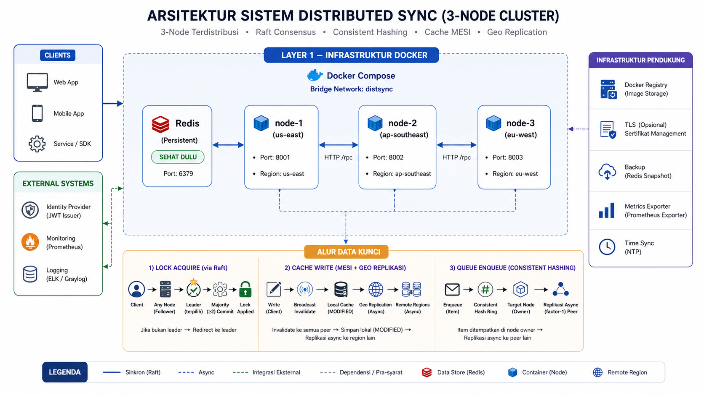

# Tugas 3 Sistem Paralel dan Terdistribusi, Sinkronisasi dan Distributed Systems

| | |
|---|---|
| **Nama** | Mahardika Arka |
| **NIM** | 11231037 |
| **Mata Kuliah** | Sistem Parallel & Terdistribusi  |

Implementasi sistem sinkronisasi terdistribusi yang mensimulasikan skenario *real-world* dari *distributed systems*. Sistem ini menangani multiple nodes yang berkomunikasi dan mensinkronisasi data secara konsisten, mencakup fitur **Distributed Lock Manager** (dengan Raft Consensus), **Distributed Queue** (dengan hashing & persistence), dan **Cache Coherence** (dengan protokol MESI), serta mendukung simulasi geo-distributed multi-region.

## Video Tutorial Youtube:
Link Video: https://youtu.be/N2JX5QzHRE0

---

## Arsitektur



> Diagram di atas menggambarkan arsitektur dari sistem sinkronisasi terdistribusi yang mengintegrasikan berbagai node melalui protokol konsensus untuk manajemen *lock*, sistem antrean (*queue*) antar node, sinkronisasi *cache* antar region, dan komunikasi aman.

## Struktur Proyek

```text
tugas3/
├── src/
│   ├── nodes/          # Implementasi Node API
│   ├── consensus/      # Logika Raft consensus
│   ├── communication/  # Message passing & failure detection
│   ├── geo/            # Simulasi fitur Geo-distributed
│   ├── security/       # TLS, RBAC, audit logging
│   ├── utils/          # Config & metrics
│   └── main.py         # Entry point aplikasi untuk tiap node
├── tests/              # Unit & integration tests
├── benchmarks/         # Script load testing (Locust)
├── docker/             # Dockerfile & docker-compose.yml
├── docs/               # Dokumentasi tambahan
└── requirements.txt
```

---

## Cara Menjalankan

### Prasyarat
- [Docker](https://www.docker.com/) & Docker Compose terinstal
- Python 3.11 (jika ingin menjalankan manual di lokal)

### 1. Menjalankan Cluster Server (Docker Compose - Direkomendasikan)

Buka terminal dan jalankan:
```bash
cd docker
docker compose up --build
```

Ini akan menjalankan infrastruktur node berikut:
- **Redis** pada port `6379`
- **Node 1** (Region: us-east) pada port `8001`
- **Node 2** (Region: ap-southeast) pada port `8002`
- **Node 3** (Region: eu-west) pada port `8003`

### 2. Menghentikan Server
```bash
cd docker
docker compose down
```

---

## Menjalankan Tanpa Docker (Lokal)

Buka terminal berbeda untuk masing-masing perintah:
```bash
# Install dependencies
pip install -r requirements.txt

# Start Redis (Pastikan Redis server tersedia di port 6379)
docker run -d -p 6379:6379 redis:7-alpine

# Terminal 1 - Node 1
NODE_ID=node-1 NODE_PORT=8001 NODE_REGION=us-east python -m src.main

# Terminal 2 - Node 2
NODE_ID=node-2 NODE_PORT=8002 NODE_REGION=ap-southeast python -m src.main

# Terminal 3 - Node 3
NODE_ID=node-3 NODE_PORT=8003 NODE_REGION=eu-west python -m src.main
```

---

## 🔌 API Endpoints

Sistem terbagi dalam beberapa modul. Berikut ini adalah Endpoint utama (bisa diakses di setiap port node, misal `http://localhost:8001`):

### Distributed Lock Manager
| Method | Endpoint | Deskripsi |
|--------|----------|-----------|
| `POST` | `/lock/acquire` | Mengambil shared/exclusive lock |
| `POST` | `/lock/release` | Melepas lock |
| `GET`  | `/lock/status` | Melihat semua lock aktif |
| `GET`  | `/lock/deadlocks` | Mengecek deadlock |

### Distributed Queue
| Method | Endpoint | Deskripsi |
|--------|----------|-----------|
| `POST` | `/queue/enqueue` | Memasukkan pesan ke queue |
| `POST` | `/queue/dequeue` | Mengambil pesan |
| `POST` | `/queue/ack/{id}`| Acknowledge pesan |
| `GET`  | `/queue/status`  | Statistik queue |

### Cache Coherence
| Method | Endpoint | Deskripsi |
|--------|----------|-----------|
| `GET`  | `/cache/get/{key}` | Membaca dari cache |
| `POST` | `/cache/put` | Menyimpan data ke cache |
| `DELETE`| `/cache/invalidate/{key}` | Menghapus entry cache |

### General & Security
| Method | Endpoint | Deskripsi |
|--------|----------|-----------|
| `GET`  | `/geo/latency` | Matrix Latency antar region |
| `GET`  | `/health` | Mengecek status kesehatan node |
| `GET`  | `/raft/status` | Melihat state dari Raft consensus |

---

### Contoh Request `POST /lock/acquire`
```bash
curl -X POST http://localhost:8001/lock/acquire \
  -H "Content-Type: application/json" \
  -d '{"resource": "db-connection", "client_id": "worker-1", "lock_type": "exclusive"}'
```

---

## Testing & Benchmarks

Terdapat *test suite* untuk memastikan logika sinkronisasi dan distribusi berjalan dengan baik:

```bash
# Menjalankan Unit tests
pytest tests/unit/ -v

# Menjalankan Integration tests (Node harus berjalan)
pytest tests/integration/ -v -m integration

# Load Testing menggunakan Locust
locust -f benchmarks/load_test_scenarios.py --host http://localhost:8001
```
