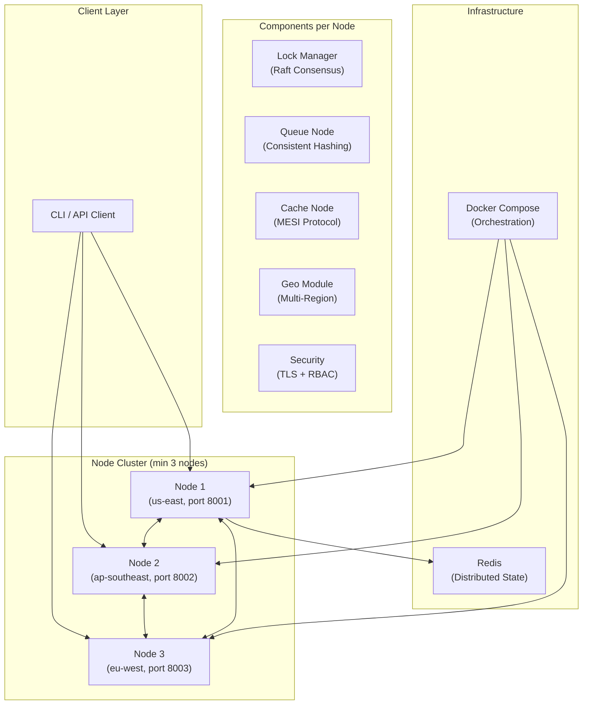
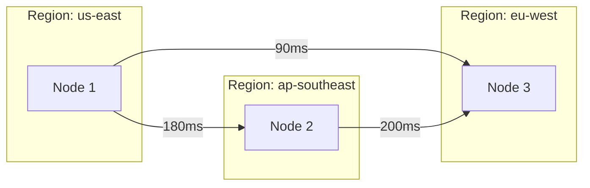

# Arsitektur Sistem

## Overview

Sistem sinkronisasi terdistribusi ini menggunakan arsitektur peer-to-peer dimana setiap node menjalankan semua komponen (Lock Manager, Queue, Cache, Geo, Security) sebagai satu unified service.

## Diagram Arsitektur



## Algoritma

### 1. Raft Consensus (Lock Manager)

Digunakan untuk leader election dan replikasi lock state di semua node.

**States:** Follower → Candidate → Leader

**Flow:**
1. Node dimulai sebagai Follower
2. Jika tidak menerima heartbeat, mulai election (menjadi Candidate)
3. Candidate meminta vote dari peers
4. Jika mendapat majority vote, menjadi Leader
5. Leader mengirim heartbeats dan mereplikasi log entries

### 2. Consistent Hashing (Queue)

Digunakan untuk mendistribusikan message ke node berdasarkan partition key.

**Virtual Nodes:** 150 virtual nodes per physical node untuk distribusi merata.

**Replication:** Setiap message direplikasi ke `replication_factor` (default: 2) node.

### 3. MESI Protocol (Cache)

Cache coherence protocol yang menjaga konsistensi data antar cache nodes.

**States:**
- **M (Modified):** Data dimodifikasi lokal, dirty
- **E (Exclusive):** Satu-satunya copy, clean
- **S (Shared):** Multiple copies exist, clean
- **I (Invalid):** Data tidak valid

**Transitions:**
```
Read (no copy):  I → E
Read (has copy):  I → S
Local write:     S → M, E → M
Remote read:     M → S, E → S
Remote write:    M → I, S → I, E → I
```

### 4. Geo-Distributed

**Latency Simulation:**
| From \ To | us-east | ap-southeast | eu-west |
|-----------|---------|--------------|---------|
| us-east | 1ms | 180ms | 90ms |
| ap-southeast | 180ms | 1ms | 200ms |
| eu-west | 90ms | 200ms | 1ms |

**Eventual Consistency:** Vector clocks untuk conflict detection, Last-Writer-Wins (LWW) untuk resolution.

### 5. Security

- **mTLS:** Self-signed CA, auto-generated per-node certificates
- **RBAC:** Admin, Operator, Viewer roles dengan permission matrix
- **Audit:** Hash chain tamper-proof logs (mirip blockchain)

## Network Topology


